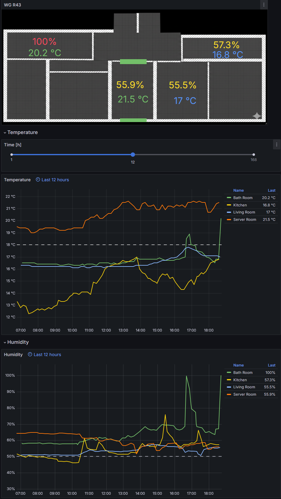

I built a custom home-server environment to monitor my living space in real-time. To achieve this, I connected several **temperature and humidity sensors** to **ESP32 controllers** distributed throughout my flat. Additionally, I installed door and window sensors connected via a **SONOFF Zigbee dongle**.

All sensors transmit their data to a central bridge, which forwards the information into an **InfluxDB** time-series database.

### The Setup
My home automation system collects data from various sensors (temperature, energy consumption, network traffic). The core stack consists of:

* **Data Sources:** Diverse IoT sensors (ESP32-based climate sensors and SONOFF door/window sensors).
* **Communication:** MQTT and an InfluxDB bridge running on a **Raspberry Pi**.
* **Database:** InfluxDB for efficient time-series storage.
* **Visualization:** **Grafana** for real-time monitoring and historical analysis.

### Key Insights
This dashboard allows me to track environmental changes and room activity precisely. It was an excellent project to practice **MQTT protocols**, **API integration**, and **data pipeline management** before the information reaches the final dashboard.

