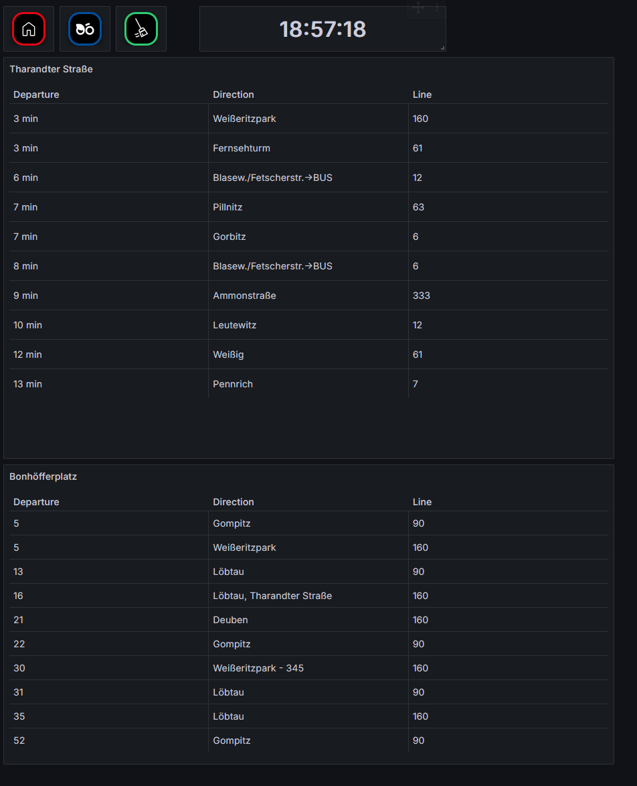
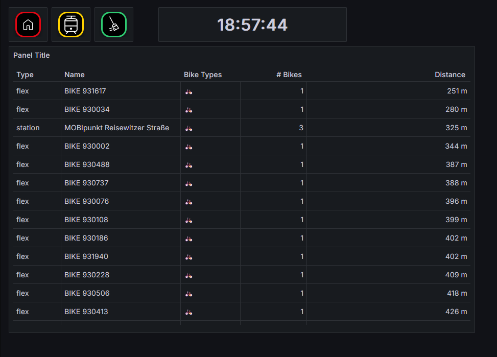

To make my Home Dashboard even more practical for daily life, I decided to integrate real-time mobility data. Living in Dresden, I wanted to see exactly when the next tram or bike is available without opening multiple apps.

### Integrating Local Transport (DVB)

I extended the dashboard with a live overview of upcoming departures from stations near my flat.

* **The Tech:** I used the **DVB.py** Python package to interface with the VVO (Verkehrsverbund Oberelbe) data.
* **The Process:** A script fetches the live departure times, filters for relevant lines, and pushes the data into my InfluxDB.

### Bike Sharing Integration (Nextbike)

In addition to public transport, I implemented a tracking feature for **Nextbike** (the local bike-sharing provider).

* **API Utilization:** By querying the Nextbike API, I can now see the number of available bikes and their exact locations in my immediate vicinity.
* **Benefit:** This allows for a seamless decision-making process in the morning: Tram, bike, or walk?

### Technical Takeaway

This extension was a great exercise in:

* **Working with external APIs** and handling JSON data.
* **Python scripting** for automated data retrieval.
* **Data transformation:** Converting live API responses into time-series formats suitable for Grafana.

  <a href="https://github.com/LPI24/SmartHomeDashboard" class="btn btn-outline-primary" role="button" target="_blank">
    <i class="bi bi-github"></i> View Project on GitHub
  </a>
