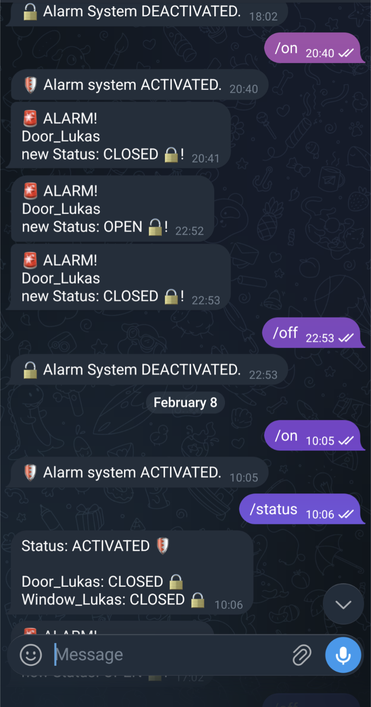

Monitoring dashboards is great, but receiving active alerts is better. I developed a **Python-based Telegram Bot** that acts as a bridge between my home sensors and my smartphone.

### Why a Telegram Bot?
Unlike traditional dashboards, a bot can proactively reach out when certain conditions are met. I used the `python-telegram-bot` library to implement this logic.

{width=200px fig-align="left"}

### Core Features
* **Real-time Alerts:** The bot sends a message if bot is activated (/on) and the window or door is opened.
* **Status Queries:** You can retrieve the status of the window and/or door (/status)

### The Technical Stack
* **Language:** Python
* **API:** Telegram Bot API (via `python-telegram-bot`)
* **Data Connection:** MQTT via Zigbee Dongle

> This project demonstrates how to build functional interfaces for data systems, moving from passive monitoring to active automation.

  <a href="https://github.com/LPI24/Telegram_Door_Sensor_Alarm_Bot" class="btn btn-outline-primary" role="button" target="_blank">
    <i class="bi bi-github"></i> View Project on GitHub
  </a>
