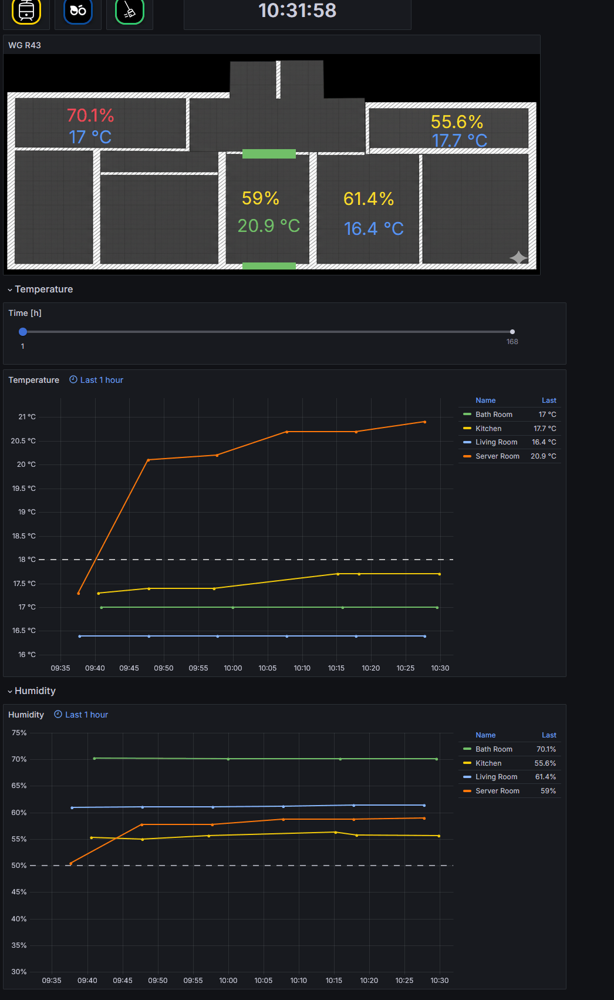

## Project Overview

This project focuses on monitoring and visualizing live data from my apartment. The goal was to create a centralized hub..

### Key Features
* **Real-time Monitoring:** Live tracking of temperature, humidity, and door/window status.
* **Historical Analysis:** Long-term data storage to identify seasonal trends.
* **Public Transport and Bike Sharing Integration**

### The Tech Stack
* **Visualization:** [Grafana](https://grafana.com/)
* **Database:** InfluxDB
* **Data Source:** Home Assistant / Custom sensors

---

### Implementation Details
The data is collected via various sensors and pushed into a time-series database. Grafana queries this data to display interactive panels. I optimized the layout for a 10-inch wall-mounted tablet to ensure high readability at a glance.

### Code & Repository
You can find the full source code on GitHub:

[View on GitHub](https://github.com/LPI24/SmartHomeDashboard){.btn .btn-outline-primary .btn-sm role="button"}
